# AI Codebase Knowledge: Kaksh AI

## Overview
Kaksh AI (Open-source AI Interactive Classroom) is an advanced, multi-agent AI-powered learning platform. It allows users to upload documents (like PDFs) and provide a prompt to autonomously generate interactive, multi-modal course materials. The platform includes a complex multi-agent orchestration system, rendering different types of educational scenes (slides, quizzes, interactive models, and project-based learning).

## Technology Stack
- **Framework**: Next.js (App Router), React 19
- **Styling**: Tailwind CSS v4, Radix UI, shadcn/ui, Framer Motion (`motion/react`)
- **State Management**: Zustand, Immer
- **Client-side Storage**: Dexie (IndexedDB) for persistent state (stages, scenes, generated media)
- **AI Ecosystem**: Vercel AI SDK (`ai`, `@ai-sdk/*`), LangChain / LangGraph (`@langchain/langgraph`)
- **Rich Text / Renderers**: ProseMirror, KaTeX, ECharts
- **Monorepo**: Uses `pnpm` workspaces (custom local packages: `mathml2omml`, `pptxgenjs`)

---

## Architecture Diagram

The system is heavily client-side focused for state and rendering, leveraging Next.js API routes as stateless proxies to various LLM providers.

```mermaid
graph TD
    subgraph Client [Frontend - Next.js / React 19]
        UI[React Components - App Router]
        Store[Zustand State Management]
        DB[(Dexie IndexedDB)]
        Renderer[Scene Renderers - Slides, Quizzes, Interactive, PBL]
        AgentUI[Multi-Agent Chat UI]
        
        UI --> Store
        Store <--> DB
        UI --> Renderer
        UI --> AgentUI
    end

    subgraph Server [Backend - Next.js API Routes]
        API_Chat[/api/chat/]
        API_Gen[/api/generate/*]
        LangGraph[LangGraph Orchestrator]
        AI_Providers[AI Provider Abstraction]
        
        API_Chat --> LangGraph
        LangGraph --> AI_Providers
        API_Gen --> AI_Providers
    end

    subgraph External [External Services]
        LLM[LLMs - OpenAI, Anthropic, Google, etc.]
        MediaGen[Media Generation APIs]
    end

    AgentUI -- "Streaming SSE" --> API_Chat
    Renderer -- "HTTP POST" --> API_Gen
    AI_Providers --> LLM
    AI_Providers --> MediaGen
```

---

## User Flow Diagram

This flow illustrates the user's journey from landing on the platform to interacting with the generated course and AI agents.

```mermaid
sequenceDiagram
    actor User
    participant LandingPage as app/page.tsx
    participant Preview as app/generation-preview
    participant DB as Dexie (IndexedDB)
    participant Classroom as app/classroom/[id]
    participant Server as API Routes
    participant LLM as AI Models
    
    User->>LandingPage: Enters Prompt, Uploads PDF, Configures Providers
    LandingPage->>Preview: Redirects with session context
    Preview->>Server: Request Scene Outlines (Stage 1)
    Server->>LLM: Generate Course Structure
    LLM-->>Server: Return SceneOutline[]
    Server-->>Preview: Return SceneOutline[]
    Preview->>DB: Save Initial Stage Data
    Preview->>Classroom: Redirects to Classroom Player
    Classroom->>User: Displays UI & Initial Outlines
    
    rect rgb(30, 41, 59)
        note right of Classroom: Background Fleshing Out (Stage 2)
        Classroom->>Server: Request Full Scene Details sequentially (useSceneGenerator)
        Server->>LLM: Generate specific scene content (Slide/Quiz/PBL)
        LLM-->>Server: Return structured JSON content
        Server-->>Classroom: Stream generated content
        Classroom->>DB: Save Generated Scenes persistently
    end
    
    User->>Classroom: Interacts with Slides/Quizzes
    User->>Classroom: Opens Multi-Agent Chat Panel
    Classroom->>Server: /api/chat/ Sends Context & History
    Server->>LLM: LangGraph evaluates context & next speaker
    LLM-->>Server: Streams thoughts, speech, and UI actions
    Server-->>Classroom: Streams SSE (Agent Dialogue & UI Actions)
    Classroom->>User: Updates UI (e.g., changes slide) based on Actions
```



---

## Data Flow Diagram

This diagram maps how raw inputs are processed through various internal systems and state managers to become the final rendered outputs.

```mermaid
flowchart TD
    subgraph Inputs
        Prompt[User Prompt]
        Docs[PDF / Documents]
        Configs[User Settings & API Keys]
    end

    subgraph "State Management (Zustand Stores)"
        useSettingsStore((useSettingsStore))
        useStageStore((useStageStore))
        useMediaGenerationStore((useMediaGenerationStore))
    end
    
    subgraph "Processors (Frontend Hooks & Backend Logic)"
        OutlineGen[Outline Generator /api/generate-classroom]
        SceneGen[Scene Detail Generator /api/generate/*]
        MediaOrchestrator[Media Orchestrator lib/media]
        ChatOrchestrator[LangGraph Chat Orchestrator /api/chat]
    end

    subgraph "Data Outputs & Persisted State"
        Scenes[(Scene JSON Data)]
        Media[(Images / Videos)]
        Actions[Structured UI Actions]
        Dialogue[Agent Speech / Thoughts]
    end

    %% Flow logic
    Configs --> useSettingsStore
    Prompt --> OutlineGen
    Docs --> OutlineGen
    useSettingsStore --> OutlineGen
    
    OutlineGen --> |Produces SceneOutline[]| useStageStore
    
    useStageStore --> SceneGen
    SceneGen --> |Produces Full Scene JSON| Scenes
    Scenes --> useStageStore
    
    useStageStore --> MediaOrchestrator
    MediaOrchestrator --> |Dispatches Tasks| useMediaGenerationStore
    useMediaGenerationStore --> |Fetches & Stores| Media
    
    useStageStore --> ChatOrchestrator
    ChatOrchestrator --> Actions
    ChatOrchestrator --> Dialogue
    Actions --> |Triggers store updates| useStageStore
```

---

## Architectural Paradigms

### 1. Two-Stage Generative Pipeline
Course generation follows a strictly typed, multi-stage pipeline (`lib/types/generation.ts`):
- **Stage 1 (Outlining)**: User requirements + Documents → `SceneOutline[]`. This identifies the high-level flow (topics, key points, desired interactive types).
- **Stage 2 (Fleshing out)**: `SceneOutline[]` → Full `Scene` objects. This dynamically spins up specific generators based on the scene type:
  - **Slide**: AI-generated `PPTElement`s, charts, LaTeX formulas.
  - **Quiz**: AI-generated multiple-choice or short-answer questions with grading logic.
  - **Interactive**: HTML/JS output embedded in an iframe, including a scientific modeling phase for simulations.
  - **PBL (Project-Based Learning)**: Generates a project config with milestones and problem-solving targets.
  - Generates media (images, videos) based on outlines (`lib/media/media-orchestrator.ts`) into a background queue.

### 2. Multi-Agent Orchestration (`LangGraph`)
Found in `lib/orchestration/`. Kaksh AI supports a conversational multi-agent system where multiple AI personas (with different backgrounds and configurations) discuss the course content with the user.
- **Director Graph (`director-graph.ts`)**: A LangGraph `StateGraph` that manages turn-taking. 
  - **Director Node**: Evaluates context and decides the next speaker (Agent A, Agent B, User, or End). Uses LLM decision-making for multi-agent and fast-paths for single-agent.
  - **Agent Generate Node**: Streams out agent thoughts, dialogue, and executable UI actions.
- **Stateless Streaming**: The `POST /api/chat/route.ts` endpoint is entirely stateless. The frontend passes the full history, active agents, and store state. The backend streams back SSE events (`thinking`, `text_delta`, `action`, `agent_start/end`, `cue_user`).
- **Actions/Tool Usage**: Agents can dispatch UI actions (`lib/types/action.ts`), such as pointing a laser, navigating slides, or using the whiteboard (`wb_draw`, `wb_clear`). These are parsed from structured LLM outputs and emitted as events.

### 3. State Management (`Zustand`)
The frontend heavily relies on multiple specialized Zustand stores (`lib/store/`):
- **`useStageStore`**: Manages the structure of the course (`stage`, `scenes`, `currentSceneId`). Automatically syncs to IndexedDB via debounced saves. Handles auto-resuming generation if interrupted.
- **`useMediaGenerationStore`**: Manages asynchronous tasks for generating images and videos without blocking course rendering.
- **`useCanvasStore` / `useWhiteboardHistoryStore`**: Manages interactive drawing elements injected over scenes.
- **`useSettingsStore`**: User preferences, AI provider configurations (API keys, Base URLs, specific models for specific tasks).

## Directory Structure & Routing

### `app/` (Routing)
- `page.tsx`: The landing page. Handles user input (prompt, PDF upload, configuration) and initiates the generation session in sessionStorage.
- `generation-preview/`: A transitional route showing the progress of Stage 1 outline generation and PDF parsing.
- `classroom/[id]/page.tsx`: The primary "Classroom Player". Loads course data from IndexedDB (fallback to API). Renders the `Stage` component. Uses `useSceneGenerator` hook to lazily generate the full scene contents in the background while the user views already generated scenes.
- `api/chat/route.ts`: Streaming LangGraph execution for the interactive agent chat.
- `api/generate/*`: Specific endpoints for different generation tasks.

### `lib/` (Core Logic)
- `ai/`: Model provider abstractions (`providers.ts`, `llm.ts`), ensuring compatibility across OpenAI, Anthropic, Google, etc.
- `orchestration/`: LangGraph implementation, Director LLM prompts, structured action parsers, and agent registry.
- `store/`: Zustand state definitions.
- `types/`: Heavily typed TS interfaces defining `Stage`, `Scene`, `Action`, `Chat`, `Generation`.
- `media/`, `pdf/`, `export/`: Utility logic for handling rich media, parsing documents, and exporting to standard formats.

### `components/` (UI Architecture)
- `stage/`: The core layout for the classroom (`stage.tsx`, `scene-sidebar.tsx`).
- `scene-renderers/`: Modular components rendering the specific content for the current scene:
  - `slide-renderer/`: Complex rendering engine converting JSON elements to a visual slide.
  - `quiz-renderer.tsx`: Renders test questions, handles submissions and auto-grading.
  - `interactive-renderer.tsx`: Injects AI-generated web code via iframes.
  - `pbl-renderer.tsx`: Renders project briefs and milestones.
- `ai-elements/` & `agent/`: UI for multi-agent avatars, conversation timelines, thought processes (`chain-of-thought`), and controls.

## Key Takeaways for Future Edits
- **Do not mutate state directly**: Always rely on Zustand action dispatchers. The `useStageStore` handles automatic debounced saves to IndexedDB to prevent data loss.
- **Provider Agnostic**: All LLM calls must route through `lib/ai/providers.ts` using the Vercel AI SDK to maintain compatibility with custom Base URLs and varying models.
- **Stateless Agent Backend**: Do not attempt to store conversational memory on the server. The entire required context (messages, scene state, whiteboard ledger, agent configs) is sent with every `/api/chat` request.
- **Streaming over REST**: Use `config.writer()` in LangGraph nodes to push events in real-time, respecting the SSE format expected by the frontend.