# KakshAI Architecture

This document reflects the architecture currently implemented in the repository.

## High-Level View

```mermaid
flowchart TD
  U[User]

  subgraph Client["Next.js Client"]
    LP["Landing Page\napp/page.tsx"]
    GP["Generation Preview\napp/generation-preview/page.tsx"]
    CP["Classroom Page\napp/classroom/[id]/page.tsx"]
    ST["Stage Runtime\ncomponents/stage.tsx"]
    CHAT["Chat Runtime\ncomponents/chat/use-chat-sessions.ts"]
    VOICE["Voice Agent Panel\ncomponents/agent/*"]

    SSTORE["Zustand Stores\nstage/settings/canvas/media"]
    IDB["IndexedDB via Dexie\nstages/scenes/chats/media/audio/agents"]
  end

  subgraph Api["Next.js Route Handlers"]
    PDF["/api/parse-pdf"]
    WS["/api/web-search"]
    SCRAPE["/api/scrape-url"]
    AGENTS["/api/generate/agent-profiles"]
    OUTLINES["/api/generate/scene-outlines-stream"]
    CONTENT["/api/generate/scene-content"]
    ACTIONS["/api/generate/scene-actions"]
    TTS["/api/generate/tts"]
    IMG["/api/generate/image"]
    VID["/api/generate/video"]
    CHATAPI["/api/chat"]
    EL["/api/elevenlabs/signed-url"]
    JOB["/api/generate-classroom"]
    JOBSTATUS["/api/generate-classroom/[jobId]"]
    CLASSROOM["/api/classroom"]
    PROVIDERS["/api/server-providers"]
  end

  subgraph Core["Core Domain / Orchestration"]
    SG["useSceneGenerator\nclient generation loop"]
    SO["statelessGenerate"]
    DG["director-graph\nLangGraph orchestration"]
    SA["Stage API\nlib/api/stage-api.ts"]
    PE["PlaybackEngine"]
    AE["ActionEngine"]
    CG["generateClassroom\nserver background pipeline"]
    CFG["provider-config / resolve-model"]
  end

  subgraph External["External Providers"]
    LLM["LLM Providers"]
    FIRE["Firecrawl"]
    PDFP["PDF Providers"]
    TTSX["TTS / ASR Providers"]
    IMGX["Image / Video Providers"]
    ELX["ElevenLabs Realtime"]
  end

  U --> LP
  LP -->|sessionStorage seed| GP

  GP --> PDF
  GP --> WS
  GP --> AGENTS
  GP --> OUTLINES
  GP --> SG
  SG --> CONTENT
  SG --> ACTIONS
  SG --> TTS
  SG --> IMG
  SG --> VID

  GP --> SSTORE
  SG --> SSTORE
  SSTORE <--> IDB
  GP -->|navigate with stageId| CP

  CP --> ST
  CP -->|load local-first| IDB
  CP -->|fallback| CLASSROOM

  ST --> PE
  ST --> AE
  ST --> CHAT
  ST --> VOICE
  CHAT --> CHATAPI
  VOICE --> EL

  CHATAPI --> SO
  SO --> DG
  DG --> LLM

  PDF --> CFG
  WS --> CFG
  SCRAPE --> CFG
  CONTENT --> CFG
  ACTIONS --> CFG
  TTS --> CFG
  IMG --> CFG
  VID --> CFG
  AGENTS --> CFG
  PROVIDERS --> CFG

  PDF --> PDFP
  WS --> FIRE
  SCRAPE --> FIRE
  TTS --> TTSX
  IMG --> IMGX
  VID --> IMGX
  EL --> ELX

  JOB --> CG
  JOBSTATUS --> CG
  CG --> SA
  CG --> LLM
  CG --> FIRE
  CG --> TTSX
  CG --> IMGX
  CG --> CLASSROOM
```

## Actual Runtime Layers

1. Input and setup
   The landing page collects topic, PDF, and provider configuration, then seeds generation state into `sessionStorage`.

2. Client-side generation pipeline
   `app/generation-preview/page.tsx` orchestrates PDF parsing, optional web search, optional agent generation, outline generation, and then hands scene generation to `useSceneGenerator`.

3. Classroom runtime
   `app/classroom/[id]/page.tsx` restores a classroom from IndexedDB first, falls back to server persistence if needed, and mounts the `Stage` runtime.

4. Stage runtime
   `components/stage.tsx` coordinates playback, roundtable, chat, whiteboard, voice, and layout state. `PlaybackEngine` and `ActionEngine` drive scene execution.

5. Stateless chat orchestration
   `/api/chat` receives full client state for each request, then `statelessGenerate` and `director-graph` run a LangGraph-driven orchestration loop and stream SSE back to the client.

6. Persistence
   Dexie stores stages, scenes, chat sessions, outlines, media, TTS blobs, and generated agents locally in IndexedDB.

7. Server-side classroom generation
   A separate background-job flow exists under `/api/generate-classroom`, which runs `generateClassroom` entirely on the server and persists results for later loading.

## Architectural Reality

- The repo has strong reusable primitives:
  - `Stage API`
  - `PlaybackEngine`
  - `ActionEngine`
  - Dexie persistence
  - provider resolution

- The repo also has major architectural drift:
  - one classroom generation path is client-driven
  - another classroom generation path is server-driven
  - the classroom runtime is concentrated in a few oversized components and stores

- The local-first design is a real strength, but it is tightly coupled to UI and orchestration concerns.
