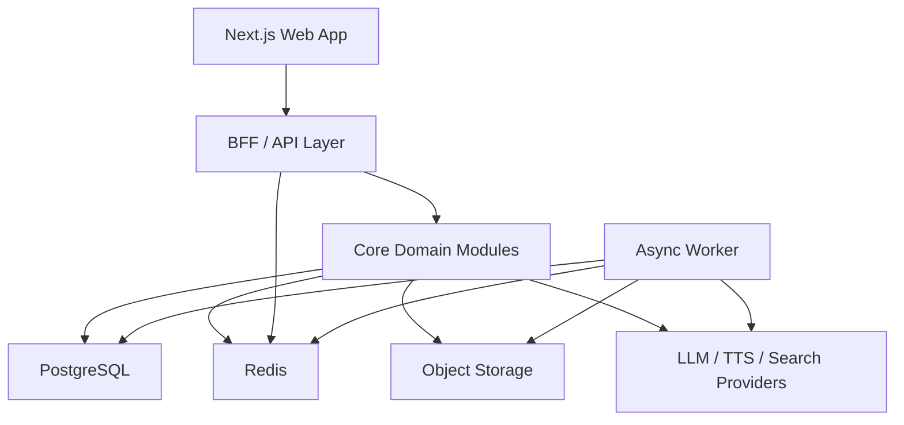

# PRD V2: KakshAI as an Adaptive Learning Platform

Status: Proposed reset

This document is the concrete follow-up to [PRODUCT_REBOOT.md](./PRODUCT_REBOOT.md).

It is intentionally opinionated.
The goal is to define the product KakshAI should become if it is meant to survive beyond demos and hackathons.

## 1. Executive Summary

KakshAI should stop behaving like a classroom generator and start behaving like an adaptive learning platform.

The new product thesis is:

> KakshAI helps a learner reach a concrete learning goal using their own materials, grounded instruction, active assessment, and persistent mastery tracking.

This requires:
- authenticated users
- a real database
- server-owned state
- async jobs
- durable media and document storage
- measurable learning outcomes

If those are not added, the product stays impressive but shallow.

## 2. Brutal Reset

### What the current product gets right

- strong lesson-generation primitives
- engaging visual runtime
- voice and whiteboard support
- support for PDFs and web content
- flexible scene system

### What the current product gets wrong

- it overvalues spectacle
- it undervalues measurable learning
- it relies too much on client-owned state
- it has weak persistence and identity
- it has no durable learner model
- it treats multi-agent behavior as core value when it is mostly an engagement layer

### Product truth

Most users do not want:
- a room full of AI classmates
- a generated slide deck for its own sake
- a technically clever orchestration system

Most users want:
- to understand something quickly
- to pass an exam
- to finish an assignment
- to prepare for an interview
- to remember what they learned later

That difference should drive the roadmap.

## 3. Product Goal

### Primary goal

Help a learner reach a defined outcome through:
- structured instruction
- grounded explanations
- adaptive pacing
- active checks for understanding
- persistent progress tracking

### Target outcomes

- faster time-to-understanding
- higher completion rate
- better retention
- more trust in generated content
- better repeat engagement

## 4. Target Users

### Persona 1: Individual Learner

Profile:
- student
- self-learner
- exam candidate
- interview candidate

Primary needs:
- turn material into a study plan
- learn interactively
- get unstuck fast
- know what they still do not understand

### Persona 2: Teacher / Instructor

Profile:
- teacher
- tutor
- course creator
- training lead

Primary needs:
- generate draft lessons
- review and edit them
- assign lessons to learners
- see learner progress and weak points

### Persona 3: Organization / Team

Profile:
- coaching institute
- school
- corporate learning team

Primary needs:
- user management
- shared content and assignment flows
- usage controls
- reporting

## 5. Jobs To Be Done

### Learner JTBD

- "Help me learn this chapter from my notes before tomorrow."
- "Turn this PDF into a guided lesson and test me at the end."
- "Teach me this concept in Hindi or English depending on what I understand better."
- "Show me what I got wrong and what to revise next."

### Teacher JTBD

- "Turn my material into a lesson plan I can review before giving it to students."
- "Assign a learning session and track who actually understood it."
- "Reuse generated lessons without recreating everything from scratch."

## 6. Product Principles

1. Learning outcome over spectacle
2. Grounded content over fluent hallucination
3. One great tutor over five mediocre agents
4. Server-owned truth over browser-owned truth
5. Editability over blind generation
6. Persistence over one-off demos
7. Measurement over vibes

## 7. Core Product Objects

The product should revolve around these objects, not around an isolated "classroom":

- `User`
- `Workspace`
- `LearningGoal`
- `SourcePack`
- `Document`
- `LessonPlan`
- `LessonSection`
- `LearningSession`
- `Assessment`
- `AssessmentAttempt`
- `MasteryProfile`
- `Artifact`

## 8. Core User Flows

### Flow 1: Learner starts from a goal

1. User signs in
2. User enters a goal
   Example: "Help me prepare for a thermodynamics quiz in 45 minutes"
3. User uploads sources or adds URLs
4. System asks a 3 to 5 question diagnostic
5. System generates a lesson plan
6. User reviews estimated duration, difficulty, and source coverage
7. User starts session
8. System teaches through text, voice, whiteboard, and quick checks
9. System runs end-of-session assessment
10. System stores mastery updates and suggests next steps

### Flow 2: Learner starts from a document

1. User uploads a PDF or adds a URL
2. System parses and chunks the content
3. User selects desired outcome
   Examples:
   - understand
   - revise
   - summarize
   - exam prep
   - interview prep
4. System generates a lesson plan around the selected outcome
5. User takes the guided session

### Flow 3: Teacher creates and assigns

1. Teacher signs in
2. Teacher creates a course or lesson goal
3. Teacher uploads sources
4. System generates a draft lesson plan
5. Teacher edits outline, difficulty, sources, and checks
6. Teacher publishes the lesson
7. Teacher assigns to learners or groups
8. Learners complete sessions
9. Teacher views completion, common mistakes, and weak areas

### Flow 4: Returning learner

1. User signs in
2. Dashboard shows:
   - active goals
   - completed sessions
   - weak topics
   - pending reviews
3. User resumes a session or starts a recommended review

## 9. MVP Product Scope

### In scope for MVP

#### 1. Authenticated accounts

- email sign-in
- magic link or OAuth
- persistent sessions
- basic role support: learner, teacher, admin

#### 2. Source ingestion

- PDF upload
- URL ingestion
- source metadata
- parse status and retry support

#### 3. Goal-driven lesson creation

- learning goal input
- source selection
- lesson plan generation
- editable lesson outline

#### 4. Guided learning session

- text mode
- voice mode
- whiteboard mode
- quiz/checkpoint support
- source-aware explanations

#### 5. Assessment and mastery

- pre-check or diagnostic
- post-session quiz
- score and feedback
- weak-topic detection

#### 6. Persistence

- user-owned lesson plans
- user-owned sessions
- resumable session state
- history and progress dashboard

#### 7. Teacher review

- edit lesson plan
- publish
- assign to learner

### Explicitly out of scope for MVP

- default multi-agent classroom as the main path
- full social classroom features
- complex organization billing
- real-time collaborative classroom editing
- highly dynamic generated simulations for every topic
- marketplace/community sharing

## 10. What Gets Demoted

These features can remain, but they are not core MVP value:

- multi-agent debate mode
- AI classmates as default
- export-heavy workflows
- chat-app integration as primary entrypoint
- cinematic scene generation for its own sake

## 11. Functional Requirements

### 11.1 Authentication

The system must:
- support account creation and login
- persist sessions across devices
- support learner and teacher roles
- support passwordless or OAuth login
- support account recovery

### 11.2 Source Management

The system must:
- accept PDFs and URLs
- store parsed source content server-side
- retain source metadata and parse status
- show source coverage for a lesson
- support source deletion and regeneration

### 11.3 Lesson Planning

The system must:
- generate lesson plans from goals and sources
- estimate session length
- assign difficulty level
- allow editing before starting
- store version history

### 11.4 Session Runtime

The system must:
- present lessons in text and voice modes
- support whiteboard actions
- pause and resume sessions
- persist progress
- support checkpoints during the session

### 11.5 Assessment

The system must:
- run diagnostics before a session when relevant
- present short checks during or after a session
- score responses
- explain mistakes
- update mastery state

### 11.6 Teacher Features

The system must:
- let teachers review generated lesson plans
- let teachers publish or assign lessons
- show learner progress per assignment

### 11.7 Trust and Grounding

The system must:
- attach sources to claims where possible
- indicate when the answer is inferred
- prefer source-backed teaching when a source pack exists
- show lesson confidence or source coverage

## 12. Non-Functional Requirements

### Reliability

- source ingestion jobs must be retryable
- generation jobs must be resumable or restartable
- session state must survive refresh and device changes

### Performance

- dashboard loads should feel immediate
- long generation tasks must use async jobs and progress states
- chat/session interactions must not depend on full page refreshes

### Security

- no critical product state should rely solely on local browser storage
- uploaded content must be access-controlled
- API keys must be server-managed where possible
- role checks must happen server-side

### Observability

- request logs
- job logs
- provider cost logs
- error aggregation
- tracing for lesson generation pipelines

## 13. Proposed Information Architecture

### Top-level navigation

- Dashboard
- Goals
- Lessons
- Sessions
- Sources
- Reviews
- Teacher
- Settings

### Learner dashboard modules

- continue learning
- recommended review
- mastery heatmap
- recent sessions
- weak-topic list

### Teacher dashboard modules

- draft lessons
- published lessons
- assignments
- learner progress
- flagged low-confidence lessons

## 14. Data Model

The source of truth should be a server-owned relational database.

Recommended primary store:
- PostgreSQL

Recommended support systems:
- Redis for queue coordination, rate limiting, ephemeral state
- object storage for files and generated artifacts

### 14.1 Core tables

#### `users`

| Field | Type | Notes |
|---|---|---|
| `id` | uuid | primary key |
| `email` | text | unique |
| `name` | text | nullable |
| `role` | enum | learner, teacher, admin |
| `locale` | text | default language |
| `created_at` | timestamptz | |
| `updated_at` | timestamptz | |

#### `workspaces`

| Field | Type | Notes |
|---|---|---|
| `id` | uuid | primary key |
| `name` | text | |
| `owner_user_id` | uuid | fk users |
| `plan_tier` | text | free, pro, edu |
| `created_at` | timestamptz | |

#### `workspace_memberships`

| Field | Type | Notes |
|---|---|---|
| `id` | uuid | primary key |
| `workspace_id` | uuid | fk |
| `user_id` | uuid | fk |
| `role` | enum | owner, admin, teacher, learner |
| `created_at` | timestamptz | |

#### `learning_goals`

| Field | Type | Notes |
|---|---|---|
| `id` | uuid | primary key |
| `workspace_id` | uuid | fk |
| `created_by_user_id` | uuid | fk |
| `title` | text | |
| `goal_type` | text | understand, revise, exam, interview, assignment |
| `objective` | text | user-stated goal |
| `target_date` | timestamptz | nullable |
| `difficulty_preference` | text | beginner, intermediate, advanced, auto |
| `status` | text | draft, active, completed, archived |
| `created_at` | timestamptz | |
| `updated_at` | timestamptz | |

#### `source_packs`

| Field | Type | Notes |
|---|---|---|
| `id` | uuid | primary key |
| `workspace_id` | uuid | fk |
| `name` | text | |
| `created_by_user_id` | uuid | fk |
| `created_at` | timestamptz | |

#### `documents`

| Field | Type | Notes |
|---|---|---|
| `id` | uuid | primary key |
| `source_pack_id` | uuid | fk |
| `type` | text | pdf, url, text |
| `title` | text | |
| `storage_key` | text | raw file pointer |
| `source_url` | text | nullable |
| `parse_status` | text | pending, processing, ready, failed |
| `metadata_json` | jsonb | parse metadata |
| `created_at` | timestamptz | |

#### `document_chunks`

| Field | Type | Notes |
|---|---|---|
| `id` | uuid | primary key |
| `document_id` | uuid | fk |
| `chunk_index` | int | |
| `content` | text | |
| `embedding` | vector or nullable | optional for retrieval |
| `metadata_json` | jsonb | citations, page refs |

#### `lesson_plans`

| Field | Type | Notes |
|---|---|---|
| `id` | uuid | primary key |
| `learning_goal_id` | uuid | fk |
| `source_pack_id` | uuid | fk |
| `version` | int | |
| `title` | text | |
| `status` | text | draft, reviewing, published, archived |
| `estimated_minutes` | int | |
| `difficulty_level` | text | |
| `plan_json` | jsonb | structured lesson |
| `created_by_user_id` | uuid | fk |
| `created_at` | timestamptz | |

#### `lesson_sections`

| Field | Type | Notes |
|---|---|---|
| `id` | uuid | primary key |
| `lesson_plan_id` | uuid | fk |
| `order_index` | int | |
| `section_type` | text | lecture, quiz, whiteboard, discussion, exercise |
| `title` | text | |
| `content_json` | jsonb | |
| `source_refs_json` | jsonb | |

#### `assignments`

| Field | Type | Notes |
|---|---|---|
| `id` | uuid | primary key |
| `lesson_plan_id` | uuid | fk |
| `assigned_to_user_id` | uuid | fk |
| `assigned_by_user_id` | uuid | fk |
| `due_at` | timestamptz | nullable |
| `status` | text | assigned, started, completed, overdue |
| `created_at` | timestamptz | |

#### `learning_sessions`

| Field | Type | Notes |
|---|---|---|
| `id` | uuid | primary key |
| `lesson_plan_id` | uuid | fk |
| `user_id` | uuid | fk |
| `mode` | text | text, voice, mixed |
| `status` | text | not_started, active, paused, completed, abandoned |
| `started_at` | timestamptz | nullable |
| `completed_at` | timestamptz | nullable |
| `progress_json` | jsonb | section progress, cursor, checkpoints |
| `session_summary_json` | jsonb | summary and outcome |

#### `session_messages`

| Field | Type | Notes |
|---|---|---|
| `id` | uuid | primary key |
| `learning_session_id` | uuid | fk |
| `sender_type` | text | system, tutor, learner |
| `content` | text | |
| `metadata_json` | jsonb | citations, tool actions, timing |
| `created_at` | timestamptz | |

#### `assessments`

| Field | Type | Notes |
|---|---|---|
| `id` | uuid | primary key |
| `lesson_plan_id` | uuid | fk |
| `type` | text | diagnostic, checkpoint, final |
| `assessment_json` | jsonb | |
| `created_at` | timestamptz | |

#### `assessment_attempts`

| Field | Type | Notes |
|---|---|---|
| `id` | uuid | primary key |
| `assessment_id` | uuid | fk |
| `user_id` | uuid | fk |
| `learning_session_id` | uuid | fk nullable |
| `score` | numeric | |
| `feedback_json` | jsonb | |
| `submitted_at` | timestamptz | |

#### `skills`

| Field | Type | Notes |
|---|---|---|
| `id` | uuid | primary key |
| `name` | text | |
| `slug` | text | unique |
| `description` | text | |

#### `learner_skill_states`

| Field | Type | Notes |
|---|---|---|
| `id` | uuid | primary key |
| `user_id` | uuid | fk |
| `skill_id` | uuid | fk |
| `mastery_score` | numeric | 0-1 or 0-100 |
| `confidence_score` | numeric | |
| `last_evaluated_at` | timestamptz | |
| `evidence_json` | jsonb | recent attempts and signals |

#### `artifacts`

| Field | Type | Notes |
|---|---|---|
| `id` | uuid | primary key |
| `workspace_id` | uuid | fk |
| `owner_user_id` | uuid | fk |
| `artifact_type` | text | audio, image, video, export, transcript |
| `storage_key` | text | object storage path |
| `metadata_json` | jsonb | |
| `created_at` | timestamptz | |

#### `jobs`

| Field | Type | Notes |
|---|---|---|
| `id` | uuid | primary key |
| `job_type` | text | parse, ingest, generate_lesson, generate_media, tts |
| `status` | text | pending, running, succeeded, failed |
| `input_json` | jsonb | |
| `output_json` | jsonb | |
| `error_json` | jsonb | |
| `attempt_count` | int | |
| `created_at` | timestamptz | |

#### `provider_usage_events`

| Field | Type | Notes |
|---|---|---|
| `id` | uuid | primary key |
| `user_id` | uuid | fk nullable |
| `workspace_id` | uuid | fk nullable |
| `provider` | text | openai, google, elevenlabs, firecrawl |
| `operation` | text | chat, tts, scrape, parse |
| `cost_usd` | numeric | nullable |
| `tokens_in` | int | nullable |
| `tokens_out` | int | nullable |
| `latency_ms` | int | nullable |
| `metadata_json` | jsonb | |
| `created_at` | timestamptz | |

## 15. Backend Architecture

### 15.1 Required platform components

- Web app
- API/BFF layer
- core backend modules
- job worker
- PostgreSQL
- Redis
- object storage
- observability stack

### 15.2 Recommended system layout

### 15.3 Backend modules

#### Auth Module

Responsibilities:
- sign-up and sign-in
- OAuth and magic links
- session issuance and revocation
- role and membership resolution

#### User / Workspace Module

Responsibilities:
- user profile
- workspace creation
- membership management
- role checks

#### Source Ingestion Module

Responsibilities:
- upload intake
- URL intake
- parsing orchestration
- chunking
- metadata extraction
- citation indexing

#### Lesson Planning Module

Responsibilities:
- create lesson plans from goals and sources
- version lesson plans
- estimate difficulty and duration
- expose editable plan structure

#### Session Runtime Module

Responsibilities:
- load a lesson plan into a live session
- persist runtime state
- store messages and transcripts
- support resume across devices

#### Assessment Module

Responsibilities:
- create diagnostics
- create checkpoints and final assessments
- score attempts
- generate feedback

#### Mastery Module

Responsibilities:
- aggregate performance signals
- update learner skill states
- generate next-review recommendations

#### Artifact Module

Responsibilities:
- manage generated media
- manage transcripts and exports
- attach artifacts to sessions and lessons

#### Usage / Billing Module

Responsibilities:
- log provider usage
- enforce quotas
- track plan limits
- support future billing

#### Analytics / Observability Module

Responsibilities:
- event tracking
- job tracing
- failure dashboards
- cost dashboards

## 16. API Surface

These are the minimum API domains the product needs.

### Auth APIs

- `POST /auth/login`
- `POST /auth/logout`
- `GET /auth/session`

### Goal APIs

- `POST /goals`
- `GET /goals/:id`
- `PATCH /goals/:id`
- `GET /goals`

### Source APIs

- `POST /source-packs`
- `POST /source-packs/:id/documents`
- `POST /source-packs/:id/urls`
- `GET /documents/:id`
- `GET /documents/:id/status`

### Lesson APIs

- `POST /lessons/generate`
- `GET /lessons/:id`
- `PATCH /lessons/:id`
- `POST /lessons/:id/publish`

### Session APIs

- `POST /sessions`
- `GET /sessions/:id`
- `PATCH /sessions/:id/progress`
- `POST /sessions/:id/messages`
- `POST /sessions/:id/complete`

### Assessment APIs

- `POST /assessments/:id/attempts`
- `GET /users/:id/mastery`

### Teacher APIs

- `POST /assignments`
- `GET /assignments`
- `GET /assignments/:id/progress`

### Job APIs

- `POST /jobs`
- `GET /jobs/:id`

## 17. Local Cache vs Source of Truth

This distinction must be explicit.

### Server-owned source of truth

- users
- workspaces
- goals
- sources
- lesson plans
- sessions
- assessments
- mastery
- assignments
- artifacts
- usage logs

### Client-side cache only

- temporary playback cache
- offline media cache
- draft UI state
- optimistic session rendering

IndexedDB should remain a performance optimization, not the product database.

## 18. Auth Strategy

The product needs authentication immediately.

### Minimum requirements

- email-based identity
- OAuth support
- role-based access
- workspace membership
- session revocation

### Honest recommendation

If speed matters:
- use a proven auth solution integrated with the web app

If control matters more:
- implement auth as a dedicated backend module with server-side sessions

What should not happen:
- guest-mode becoming the default forever
- important user data existing without identity

## 19. Storage Strategy

### Use PostgreSQL for

- relational domain data
- lesson and session state
- progress and mastery
- assignments and permissions

### Use Redis for

- queues
- rate limiting
- ephemeral locks
- transient status

### Use object storage for

- PDFs
- parsed artifacts
- audio
- video
- generated images
- exports

## 20. MVP Delivery Plan

### Stage 1: Product Fundamentals

- auth
- PostgreSQL schema
- object storage
- user dashboard
- server-owned goals and lesson plans

### Stage 2: Learning Loop

- diagnostic flow
- lesson plan generation
- session runtime with persistence
- post-session quiz
- mastery updates

### Stage 3: Teacher Flow

- lesson review/edit
- publish
- assign
- learner progress view

### Stage 4: Hardening

- async workers
- cost tracking
- usage limits
- observability
- source-grounded answers

## 21. Success Metrics

### Product metrics

- lesson creation completion rate
- session completion rate
- day-7 return rate
- review session return rate
- assignment completion rate

### Learning metrics

- diagnostic-to-final score improvement
- repeat weak-topic reduction
- self-reported confidence increase
- time-to-goal completion

### System metrics

- job success rate
- cost per completed lesson
- parse failure rate
- hallucination / unsupported-claim rate

## 22. Risks

### Risk 1: The product remains too broad

Mitigation:
- keep MVP centered on individual learners and teacher review

### Risk 2: Generation quality is inconsistent

Mitigation:
- add lesson plan editing
- add source grounding
- add confidence indicators

### Risk 3: Infra gets added without product focus

Mitigation:
- backend work must support persistence, trust, and measurement
- not just technical cleanup for its own sake

### Risk 4: Multi-agent complexity distracts the roadmap

Mitigation:
- keep single-tutor mode as default
- position multi-agent as optional advanced mode

## 23. Kill List

These are the things that should not drive V2:

- "more agents"
- "more scene types" without better outcomes
- "more provider integrations" without product gain
- "more export formats" before persistence and mastery work
- "more cinematic generation" before trustworthy learning loops

## 24. Final Product Statement

KakshAI V2 is not:
- an AI classroom toy
- a slide generator
- a multi-agent spectacle engine

KakshAI V2 is:
- a goal-driven adaptive learning platform
- grounded in user material
- persistent across sessions and devices
- measurable in learning outcomes
- backed by real auth, real data, and a real backend
